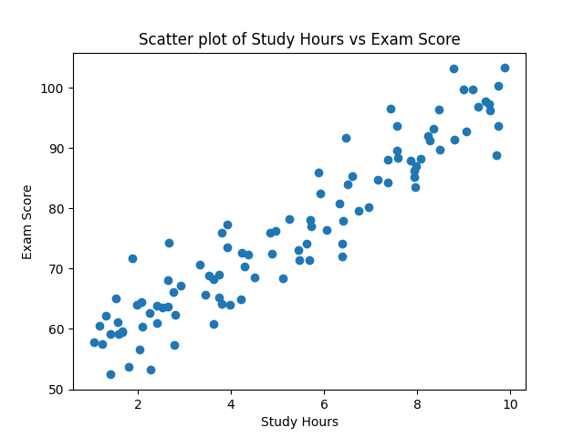
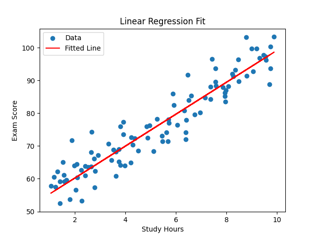
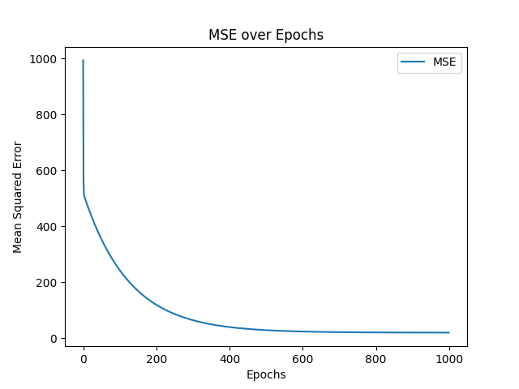

# Linear Regression from Scratch (Gradient Descent)

This repository contains a simple implementation of **Linear Regression** using **Gradient Descent** in Python. The goal is to learn the relationship between study hours and exam scores from a small dataset.

---

## 📌 Project Overview

* 🔢 Predict exam scores based on study hours.
* 🧮 Implements gradient descent manually without any ML libraries.
* 📉 Tracks error (MSE) across epochs.
* 📈 Plots for data, regression line, and MSE per epoch.

---

## 📁 Files Included

| File/Folder | Description                                                 |
| ----------- | ----------------------------------------------------------- |
| `linear_regression.py`   | Core script containing the linear regression implementation |
| `data2.csv` | Dataset: study hours vs exam scores                         |
| `images/`   | Folder containing generated plots                           |

---

## 🧪 Dataset

The dataset contains two columns:

* `studytime` (float): Number of hours studied
* `score` (float): Exam score received

---

## 📷 Visualizations

### 📊 Data Points



### 📈 Linear Regression Fit



### 🧠 Loss (MSE) vs Epochs



---

## 🚀 How to Run

```bash
python linear_regression.py
```

Make sure `data2.csv` is present in the same directory as `linear_regression.py`.

---

## 🙋‍♂️ Author

**Yash Dhankhar**

Feel free to use, learn, and modify!

---
